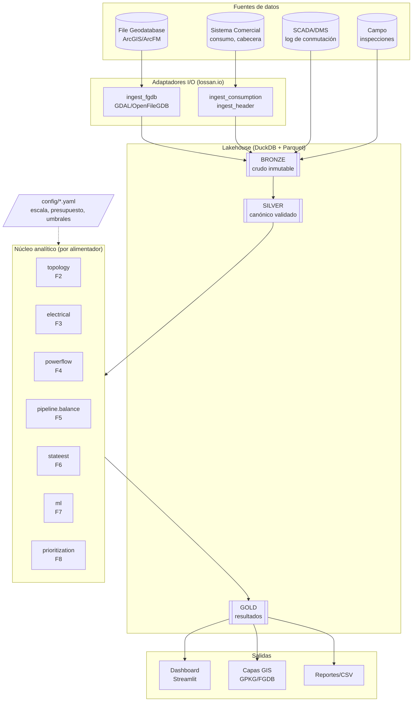
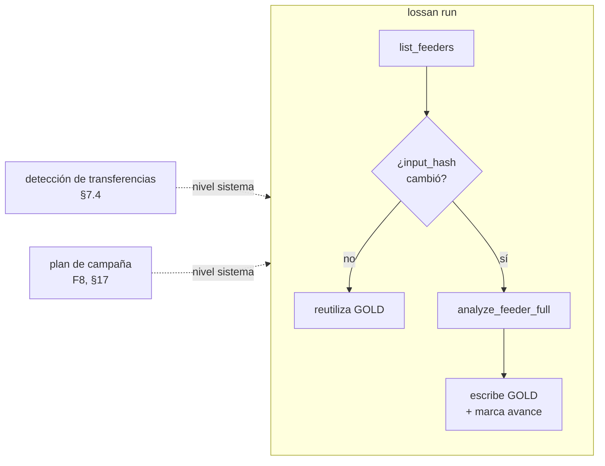
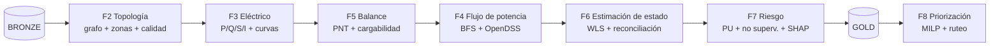
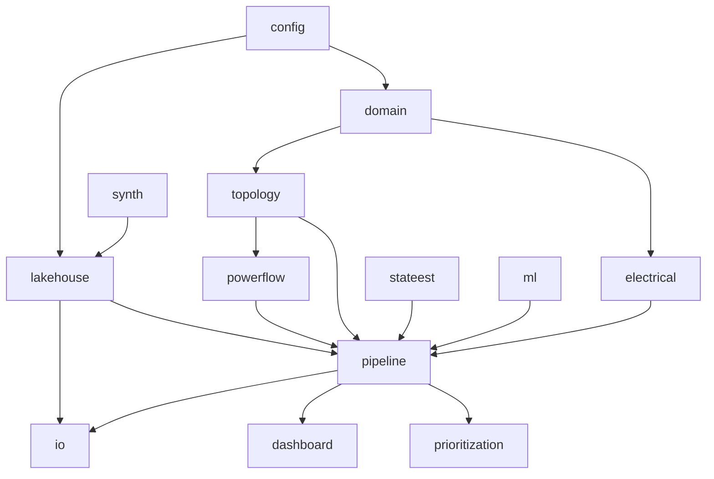

# Arquitectura de la plataforma

Plataforma analítica en Python para separar pérdidas técnicas y no técnicas
(PNT) en redes de distribución. Diseño **por capas**, **particionado por
alimentador** y **desacoplado de `arcpy`** (§2.5).

## 1. Visión por capas

- **BRONZE** — extracto crudo, inmutable, con hash de origen. Parquet.
- **SILVER** — modelo canónico normalizado y validado (`pydantic`). Parquet
  particionado por `feeder_id` (consumo también por `year_month`).
- **GOLD** — resultados: balance, pérdidas, riesgo, plan. Publicación selectiva.
- **DuckDB** como motor analítico sobre Parquet (una máquina, sin servidor).
- **Toda la parametrización** (volumetría, costos, tarifas, umbrales) vive en
  `config/` — nada en el código (§22.13).

## 2. El alimentador como unidad atómica

Cada alimentador cabe en memoria (~2.800 clientes, ~1.700 postes) y es la
**clave de partición y de paralelización** (`ProcessPoolExecutor`). El
**procesamiento incremental por hash** evita recomputar lo que no cambió (§2.3).
La detección de transferencias y la priorización son pasos **a nivel de
sistema** (un único presupuesto sobre todos los candidatos).

## 3. Pipeline por alimentador (fases)

| Fase | Módulo | Entrada → Salida |
|---|---|---|
| F2 | `topology` | segments/sites → grafo, zonas, `data_quality_findings` |
| F3 | `electrical` | consumo → P/Q/S/I, factor de pérdidas |
| F5 | `pipeline.balance` | + AP + técnicas → `feeder_balance`, `transformer_loadability` |
| F4 | `powerflow` | grafo + carga → `powerflow_results` (validado vs OpenDSS) |
| F6 | `stateest` | pseudo-medidas → `zone_state_estimation` (carga no contabilizada) |
| F7 | `ml` | features → `customer_risk` (score calibrado + razones SHAP) |
| F8 | `prioritization` | GOLD → `inspection_plan`, rankings, `campaign_summary` |

## 4. Dependencias entre módulos

El **dominio** (jerarquía poste/puesto/unidad §5.2 y fórmulas §9.2) no depende de
nada externo y es 100% testeable. Los motores de ejecución (multiprocessing,
DuckDB, OpenDSS) son intercambiables: la lógica de dominio no los conoce.

## 5. Estrategia por niveles de profundidad (§2.4)

| Nivel | Alcance | Método | Estado |
|---|---|---|---|
| N1 tamizaje | todos los alimentadores | balance + BFS 3 escenarios | ✅ motor propio |
| N2 detalle | decil superior de PNT | OpenDSS desbalanceado | ✅ exportador |
| N3 forense | campañas | QSTS + Monte Carlo + DSSE | parcial (DSSE ✅) |

## 6. Stack tecnológico

`duckdb`, `pyarrow`, `pandas`, `numpy` · `pydantic`, `typer`, `loguru` ·
`rustworkx` (topología) · `OpenDSSDirect.py` (flujo) · `scikit-learn`,
`lightgbm`, `pyod`, `ruptures`, `shap` (ML) · `ortools`, `HDBSCAN`
(optimización/ruteo) · `geopandas`/`pyogrio`/GDAL (FGDB, sin `arcpy`) ·
`streamlit`/`plotly` (dashboard) · `jinja2`/`weasyprint` (reportes PDF) ·
`dagster` (orquestación) · `pytest`/`hypothesis` (pruebas).

Ver la **[Referencia de módulos y funciones](REFERENCIA.md)** y el
**[Análisis de brechas](BRECHAS.md)**.
